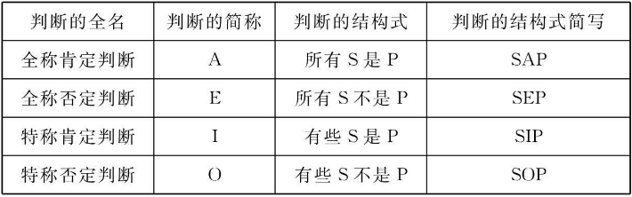

逻辑学基础
===

概念、判断、推理、论证

概念
---
<!--rehype:body-class=cols-3-->

### 什么是概念

> 概念是反映事物本质属性或特有属性的思维形式

事物具有性质和关系，统称为属性，属性具有特有属性、非特有属性、本质属性和非本质属性

- 特有属性，是指为一类事物所独有而其他类事物都不具有的那些属性（共性和个性的区分）

- 本质属性，就是决定该事物之所以成为该事物而区别于其他事物的属性（必要性和非必要性的区分）
<!--rehype:style=color: red;-->

### 概念与其他心理现象的区别

> 概念与感觉、知觉、表象有着质的区别

- 感觉、知觉、表象是反映对象的具体形象，夹杂着本质属性和非本质属性

- 概念是抽象地反映对象的本质属性，舍弃了非本质属性

### 概念与词语

> 语词是表达概念的声音与符号，是概念的语言形式，概念是语词的思想内容

- 所有的概念都要用语词来表达，但并非所有的语词都表达概念

- 不同的语词可以表达同一个概念

- 同一个语词可以表达不同的概念

### 概念的内涵和外延

> 概念的内涵就是指反映在概念中的对象的本质属性或特有属性，概念的外延是指具有概念所反映的本质属性或特有属性的对象

- 内涵和外延是互相依存、互相制约，前者指的是质的方面，后者指的是量的方面

- 概念的内涵和外延又具有灵活性，随着客观事物和认识的发展，概念的内涵和外延也会发生变化

### 概念的种类

> 根据概念内涵和外延方面的某些共同特征，可以按照不同的标准，把概念划分为若干不同的种类

- 单独概念和普遍概念

- 集合概念和非集合概念

- 正概念和负概念

### 概念间的关系

> 普通逻辑不研究概念之间的一切关系，只研究两个概念的外延之间的关系。根据概念外延之间是否重合，可以把概念分成相容关系和不相容关系两大类

#### 相容关系

- 同一关系

- 真包含关系

- 真包含于关

- 交叉关系

#### 不相容关系

- 矛盾关系

- 反对关系

### 概念的限制和概括

#### 概念内涵与外延之间的反变关系

> 一个概念的内涵越多，则外延越小；一个概念的内涵越少，则外延越大

#### 概念的限制

> 通过增加概念的内涵以减少概念外延的逻辑方法，它使一个外延较大的属概念过渡到一个外延较小的种概念

#### 概念的概括

> 通过减少概念的内涵以扩大概念外延的逻辑方法，它使一个外延较小的种概念过渡到一个外延较大的属概念

### 定义

> 定义就是明确概念内涵的逻辑方法，即揭示概念所反映的事物的本质属性或特有属性的逻辑方法

定义由被定义项、定义项和定义联项三个部分组成

- 被定义项就是要被揭示内涵的概念

- 定义项就是用来揭示被定义项内涵的概念

- 定义联项就是表示被定义项和定义项之间的联系的概念

#### 下定义的方法

- 属加种差定义：被定义项=种差+邻近的属概念

- 发生定义：发生定义是以事物产生或形成的情况作为种差而作出的定义

- 语词定义：语词定义是说明或规定语词含义的定义

#### 下定义的规则

- 定义必须相应相称

- 定义项中不能直接或间接地包含被定义项

- 定义项一般不能用否定句形式或负概念

- 定义项必须用清楚确切的科学术语

### 划分

> 划分是通过把一个概念所反映的对象，分为若干个小类，来揭示这个概念外延的逻辑方法

#### 划分的方法

划分的方法有一次划分和连续划分两种

- 一次划分就是根据划分标准把母项的外延一次划分完毕，这种划分只有母项和子项两层

- 连续划分是把第一次划分以后的子项作为母项，继续划分出子项，直到满足实践需要为止

#### 划分的规则

- 划分必须相应相称

- 划分的标准必须同一

- 划分后的各子项必须互相排斥

- 划分的层次必须清楚

判断
---
<!--rehype:body-class=cols-3-->

### 判断的概述

> 判断是对客观事物情况有所断定的一种思维形式，就是用肯定或否定的形式反映周围现实的一种思维形式

判断有两个逻辑特征：

- 判断都有所肯定或有所否定，即有所断定。断定某对象具有某属性或对象之间具有某种关系，就是对该对象有所肯定

- 判断都有真假。判断是对客观事物有所断定的一种思维形式，是对客观事物情况的反映，而不是客观事物本身

#### 判断与语句

> 语句是表达判断的语言形式，判断是语句中所表达的对某种思维对象有所断定的思维内容

- 并不是所有的语句都表达判断

- 同一个语句有时可以表达不同的判断

- 不同语句有时可以表达相同的判断

#### 判断的种类

> 根据判断是陈述了事物情况的必然性还是可能性这个标准，可以把判断分为模态判断和非模态判断两大类。

非模态判断：

- 简单判断：性质判断和关系判断

- 复合判断： 联言判断、选言判断、假言判断、负判断和多重复合判断

模态判断：

- 必然判断

- 可能判断

### 性质判断 ①

> 性质判断也称直言判断，是断定对象具有或不具有某种性质的判断

性质判断由四个部分组成，即主项、谓项、联项和量项。

- 主项是表示被断定对象的概念

- 谓项是表示被断定对象的性质的概念

- 联项也称联结项，它是联结主项和谓项的概念，表示性质判断的“质”，分为肯定和否定两种，一般用“是”和“不是”表示

- 量项是表示所断定的主项的数量或范围的概念

#### 性质判断的种类

> 性质判断可用判断的质作根据
<!--rehype:style=color: red;-->
- 肯定判断：是断定对象具有某种性质的判断，即“S是P”

- 否定判断：是断定对象不具有某种性质的判断，即“S不是P”

> 性质判断可用判断的量作根据
<!--rehype:style=color: red;-->
- 单称判断：是断定某一个别对象是否具有某种性质的判断，即“这个S是（不是）P”

- 特称判断：是断定一类对象中部分对象是否具有某种性质的判断，即“所有的S都是（不是）P”

- 全称判断：是断定一类对象的全体是否具有某种性质的判断，即“有些S是（不是）P”

> 以判断的质量为根据分类
<!--rehype:style=color: red;-->

性质判断可用质、量结合作为根据，单称判断是对主项全部外延的断定，可简化成四种判断

### 性质判断 ②